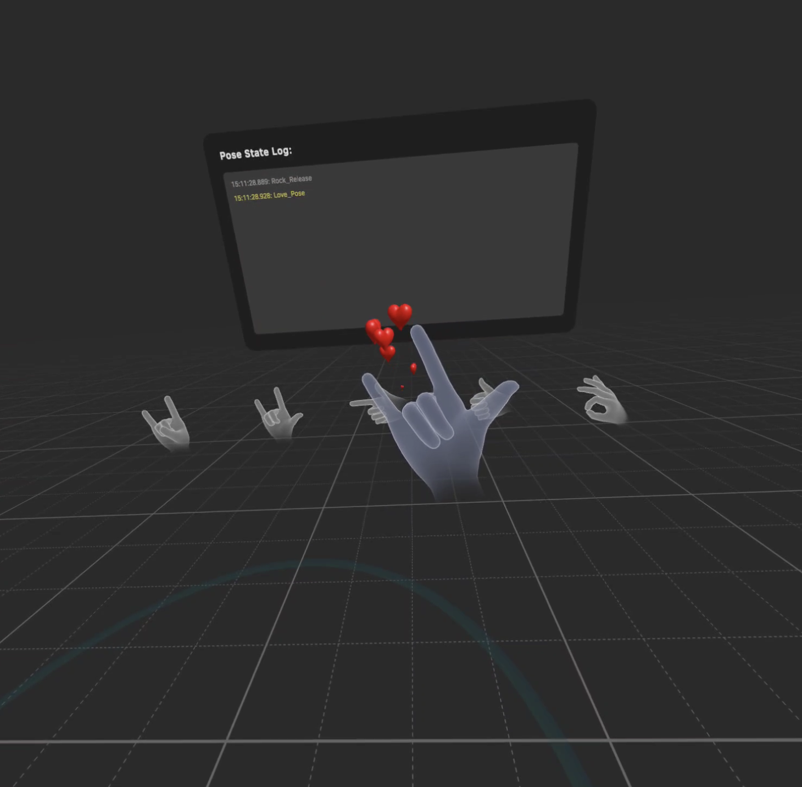

# HandTrackingSample-Unity
Demonstration of related case scenarios for gathering handtracking
# Requirement
| Environment | Version |
| ----- | ----- |
| Unity Editor | ≥2020.3 ≤2021 |
| Pico Integration SDK | ≥2.1.5 |
| Pico ROM | ≥5.4.0 |

# SampleList
| Sample Scene | Module&Doc | Description |
| ----- | ----- | ----- |
| HandPoseExample |  | How to use HandPoseEditor and show the effect of trigger logic |

We will introduce some example in the below.

